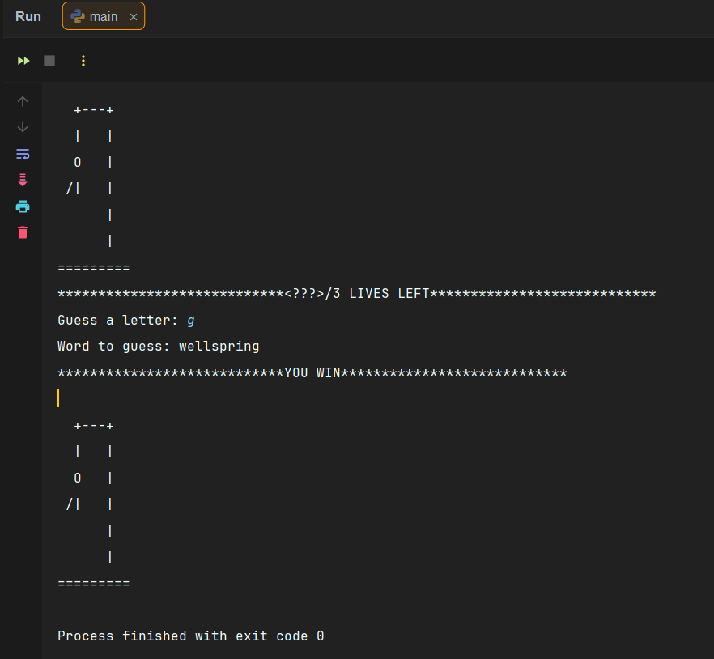

# Interactive Hangman Engine

[](https://www.python.org/)
[](LICENSE)

A guided academic project implementing a Hangman engine to demonstrate Python string manipulation, randomization, and input validation logic.

## 📚 Project Context

> **Academic Coursework:** 
> This project was developed under the guidance of a university instructor. While the project requirements and architectural structure were defined as part of the curriculum, I independently **implemented the core game logic**, **string manipulation functions**, and **input validation systems** to meet the assigned specifications.

## 🎮 Features & Logic

The game focuses on robust backend logic rather than visual UI, utilizing Python's standard libraries to ensure efficiency.

- **Dynamic Word Selection:** Utilizes Python's `random` module to select words from a predefined library efficiently.
- **String Manipulation:** Implements list slicing and string joining to reveal characters progressively based on user guesses.
- **Input Validation:** Includes error-handling logic to sanitize user input (preventing crashes from numbers or repeated guesses).
- **State Management:** Tracks game variables including lives, guessed letters, and win/loss states in real-time.

## 🚀 How to Run

1. **Clone the repository**
   ```bash
   git clone https://github.com/YOUR_USERNAME/interactive-hangman-engine.git
   ```

2. **Navigate into the directory**
   ```bash
   cd interactive-hangman-engine
   ```

3. **Run the Python script**
   Ensure you have Python 3.x installed.
   ```bash
   python hangman.py
   ```

## 📸 Gameplay Preview




## 🛠️ Tech Stack

- **Language:** Python 3.x
- **Libraries:** `random`, `string`, `sys` (No external dependencies required)

## 👨‍💻 Author

**Rajeev Khatri**
*Aspiring AI Engineer & Python Developer*

- **LinkedIn:** [linkedin.com/in/rajeev-khatri](https://www.linkedin.com/in/rajeev-khatri)
